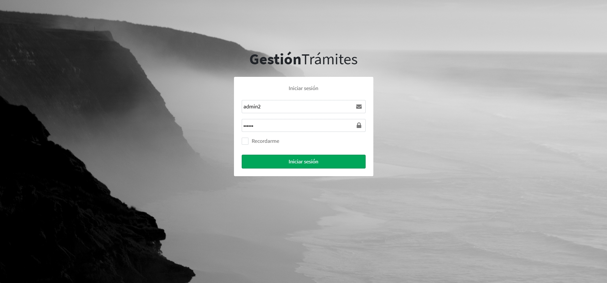
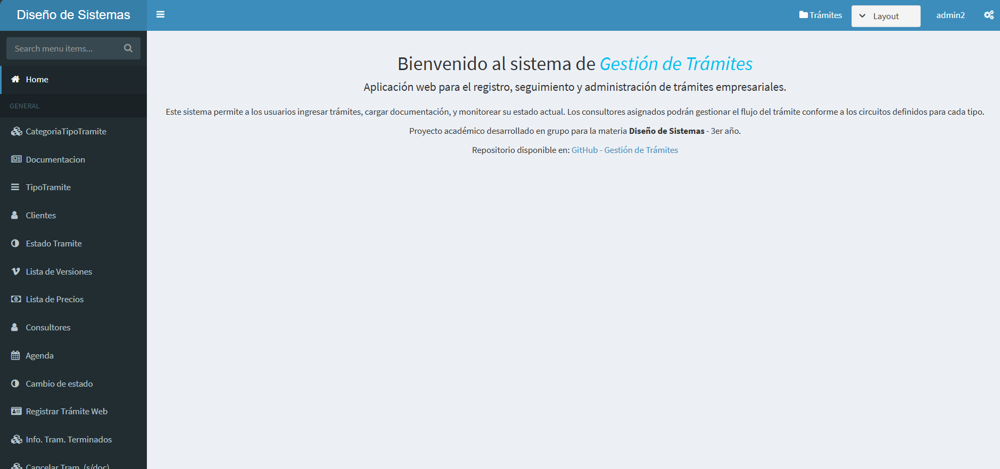
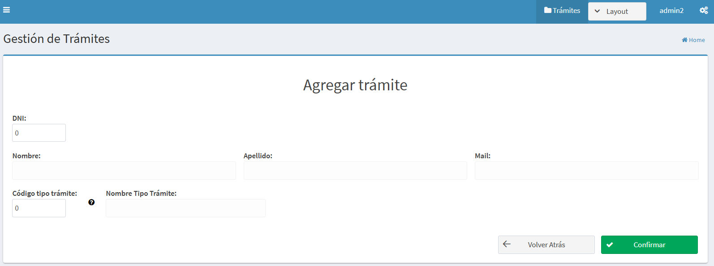
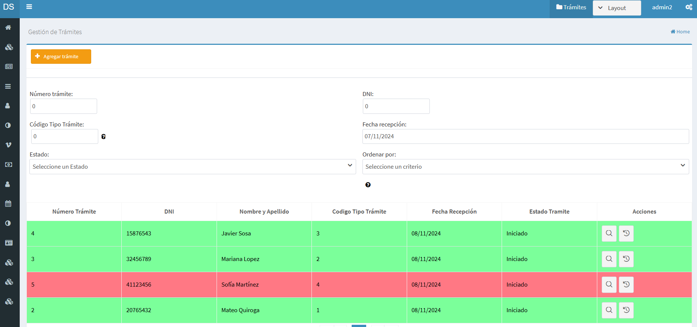
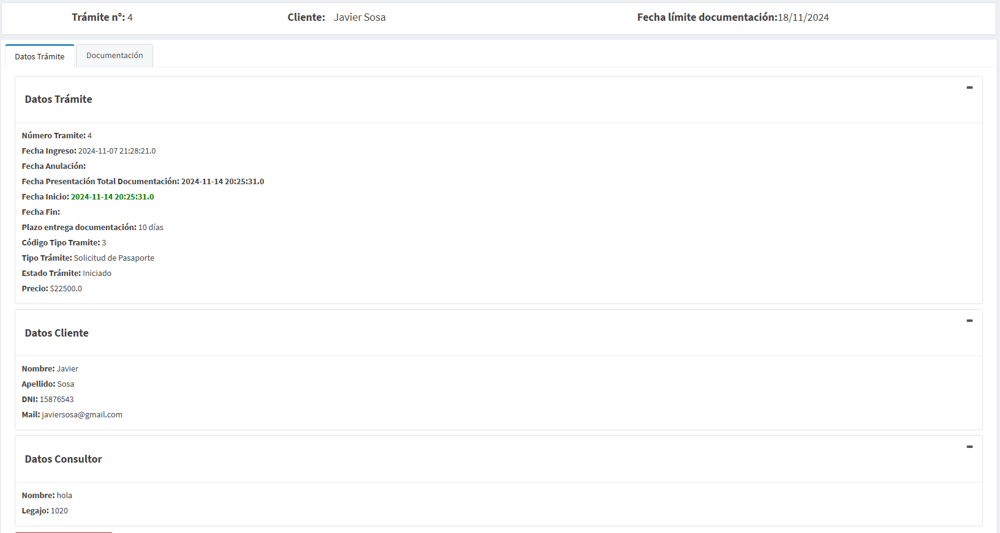
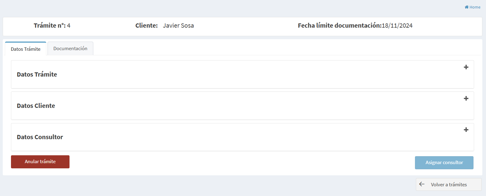
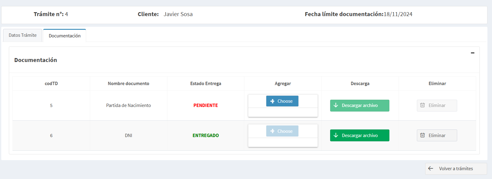
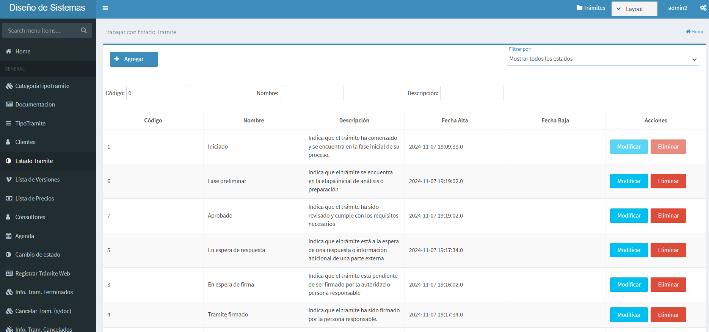
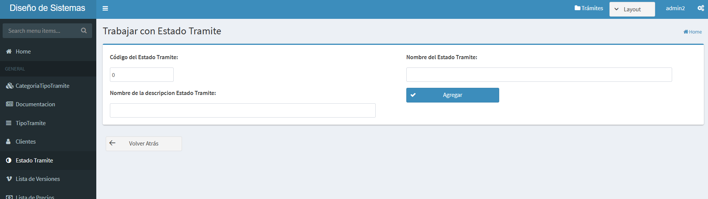

# 📋 Sistema de Gestión de Trámites
Aplicación web para registrar, administrar y hacer seguimiento del estado de trámites en una empresa de servicios. Proyecto grupal desarrollado en el marco de la materia Diseño de Sistemas (3er año).

---

## ⚙️ Tecnologías utilizadas
### 💻 Frontend
- JSF
- PrimeFaces
- AdminFaces

### 🧠 Backend
- Java
- Jakarta EE 9.1 (Web API)
- JPA (Hibernate)

---
## 📈 Diagramas importantes del sistema

### Diagrama de Casos de Uso
[Ver Diagrama de Casos de Uso (PDF)](docs/diagrams/dcu.pdf)

### Diagrama de Clases
[Ver Diagrama de Clases (PDF)](docs/diagrams/dc.pdf)

---
## 📸 Capturas del sistema

### Login
Pantalla de acceso al sistema con validación de usuario.

### Menú Principal
Pantalla inicial luego del login, con acceso a las distintas funcionalidades del sistema.

### Alta de Trámite
Formulario para registrar un nuevo trámite en el sistema (de forma presencial).

### Lista de Trámites
Listado de trámites existentes con opciones de filtrado y acciones.

### Detalle de Trámite
Visualización detallada de un trámite seleccionado.

### Anular Trámite
Opción para anular un trámite.

### Agregar Documentación
Sección para adjuntar documentación a un trámite.

### ABM Estado Trámite
Interfaz de administración de estados posibles para los trámites (alta, baja y modificación).

### ABM Estado Trámite - Vista 2

---
